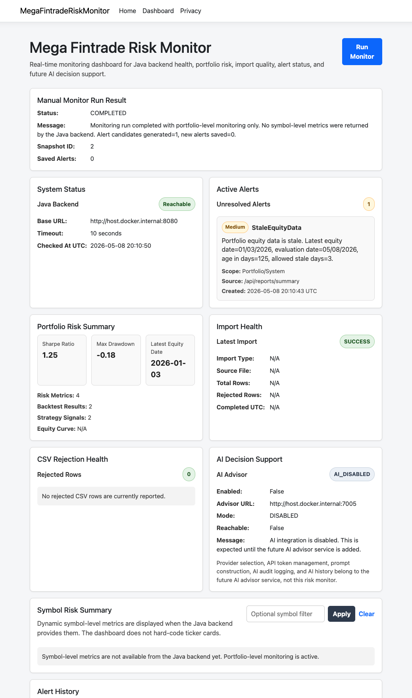
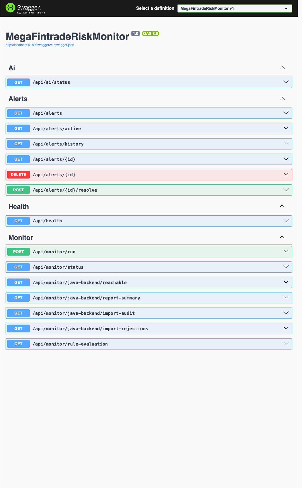
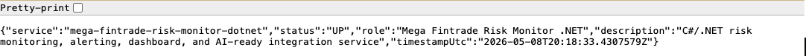
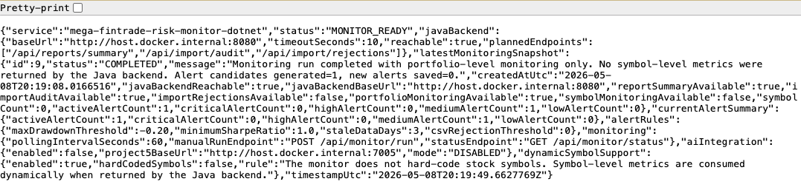
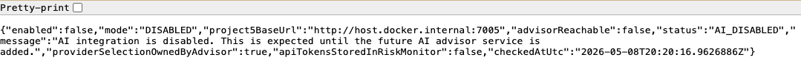
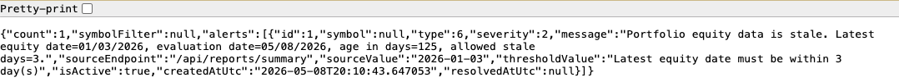

# Mega Fintrade Risk Monitor (.NET)

Mega Fintrade Risk Monitor is the monitoring, alerting, and dashboard service for the Mega Fintrade Platform.

It is a C#/.NET service that watches the Java backend, checks whether financial data imports are healthy, evaluates portfolio risk conditions, stores alert records, and presents the current system state through REST APIs and a Razor Pages dashboard.

This project represents the operational monitoring layer of the Mega Fintrade system. The upstream Java backend stores imported risk and backtest data, while this .NET service continuously checks that data and turns risk conditions into visible alerts.

The service is also AI-ready, but it does not depend on AI. A future Mega Fintrade AI Advisor service may provide optional natural-language explanations and risk summaries. This .NET monitor must continue working normally when the AI advisor is disabled, unavailable, or not yet implemented.

---

## Platform Role

Mega Fintrade is a multi-service financial data platform built with Java, Python, C++, and C#/.NET.

The platform data flow is:

1. Mega Fintrade Quant Engine downloads and prepares raw market data.
2. Mega Fintrade Market Engine C++ processes raw market data, validates records, removes invalid rows, calculates daily returns, and produces cleaned market outputs.
3. Mega Fintrade Quant Engine consumes the cleaned C++ outputs, runs quantitative analytics and backtesting, and produces strategy signals, risk metrics, backtest results, and portfolio equity curve files.
4. Mega Fintrade Backend Java imports the processed quantitative outputs, stores them, exposes report APIs, tracks import audit history, and records rejected CSV rows.
5. Mega Fintrade Risk Monitor .NET polls the Java backend APIs, evaluates deterministic alert rules, stores monitoring results, exposes alert APIs, and displays active system and portfolio risk conditions through a dashboard.
6. A future Mega Fintrade AI Advisor may provide optional AI-generated alert explanations, daily risk briefs, and decision-support summaries.

The AI advisor is optional and remains separate from this core monitoring service.

---

## Main Responsibilities

Mega Fintrade Risk Monitor provides the monitoring and alerting layer for the Mega Fintrade Platform.

Main responsibilities:

- Poll Java backend report and import-health APIs
- Detect unavailable backend services
- Evaluate deterministic portfolio risk rules
- Evaluate import-health rules
- Detect CSV rejection problems
- Store alert records
- Store monitoring snapshots
- Expose REST APIs for health, monitor status, AI status, and alerts
- Display active alerts through a Razor Pages dashboard
- Reserve an optional AI Decision Support panel for future integration
- Continue running when the AI advisor service is disabled or unavailable

---

## Technology Stack

- C#
- .NET / ASP.NET Core
- Razor Pages
- Web API Controllers
- Entity Framework Core
- SQLite
- BackgroundService
- IHttpClientFactory
- Swagger / OpenAPI
- xUnit
- Docker
- Docker Compose
- GitHub Actions
- VS Code

---

## Current Architecture

Core components:

- ASP.NET Core Web API controllers
- Razor Pages dashboard
- Configuration-based Java backend connection
- Centralized Java backend API client
- DTOs for Java backend response contracts
- Alert domain models
- Alert rule engine
- Alert persistence with SQLite
- Monitoring snapshot storage
- Background monitoring worker
- AI-ready integration placeholder
- Docker runtime packaging
- GitHub Actions restore/build/test workflow

---

## Documentation

Detailed project documentation is available in the `docs/` folder.

| Document | Purpose |
|---|---|
| `docs/java-backend-api-dependencies.md` | Explains Java backend endpoints consumed by the monitor |
| `docs/alert-rules.md` | Explains alert rules, thresholds, severity, and duplicate prevention |
| `docs/dynamic-symbol-compatibility.md` | Explains portfolio-only and future symbol-level support |
| `docs/api-reference.md` | Documents monitor, alert, health, and AI status APIs |
| `docs/dashboard-usage.md` | Explains how to use the Razor Pages dashboard |
| `docs/ai-ready-design.md` | Explains the boundary between Project 4 and future Project 5 |
| `docs/docker-usage.md` | Explains Docker build, Docker Compose, SQLite volume, and troubleshooting |

A Postman API collection is available at:

    postman/mega-fintrade-risk-monitor.postman_collection.json

---

## Java Backend API Dependencies

Mega Fintrade Risk Monitor consumes the following Java backend endpoints:

| Method | Endpoint | Purpose |
|---|---|---|
| GET | `/api/reports/summary` | Portfolio-level and future symbol-level risk summary |
| GET | `/api/import/audit` | Import job history and latest import health |
| GET | `/api/import/rejections` | CSV rejected row records |

Java backend API calls should remain centralized in the client layer.

The monitoring service should not scatter Java backend endpoint strings across controllers, services, or Razor Pages.

---

## Dynamic Symbol Compatibility

Mega Fintrade Risk Monitor supports both the current Java backend behavior and a future flexible-symbol backend design.

The monitor must not hard-code stock symbols such as AAPL, MSFT, GOOGL, or SPY.

Symbol selection belongs upstream to:

- Mega Fintrade Quant Engine
- Mega Fintrade Backend Java

Mega Fintrade Risk Monitor consumes whatever symbols the Java backend returns.

Current-compatible behavior:

- If the Java backend returns only portfolio-level metrics, the monitor evaluates portfolio-level and system-level rules only.

Future-compatible behavior:

- If the Java backend later returns symbol-level metrics, the monitor evaluates both portfolio-level and symbol-level rules dynamically.

Risk alerts support an optional symbol field:

| Symbol value | Meaning |
|---|---|
| `null` | System-level or portfolio-level alert |
| Non-null symbol | Symbol-specific alert |

Duplicate active alert prevention uses this identity rule:

    Alert type + symbol + source endpoint

This prevents alert spam while still allowing separate alerts for different symbols.

---

## AI Integration Boundary

Mega Fintrade Risk Monitor is AI-ready, but it does not directly manage AI providers.

The monitor does not store or manage API tokens for:

- Gemini
- Grok
- OpenAI
- Ollama
- Any future AI provider

A future Mega Fintrade AI Advisor service should own:

- AI provider selection
- API token management
- LLM prompt construction
- AI alert explanation
- AI daily risk brief generation
- AI analysis history
- AI audit logging

Mega Fintrade Risk Monitor only needs to know:

- Whether AI integration is enabled
- Where the AI advisor service is located
- Whether the AI advisor service is reachable
- What AI result the AI advisor service returns

If the AI advisor service is disabled or unavailable, Mega Fintrade Risk Monitor must continue to operate normally.

---

## Configuration

Main configuration files:

    appsettings.json
    appsettings.Development.json
    appsettings.Docker.json

Important configuration sections:

| Section | Purpose |
|---|---|
| `ConnectionStrings` | Stores the SQLite connection string |
| `JavaBackendApi` | Stores Java backend base URL and timeout |
| `AiIntegration` | Stores future AI advisor enabled flag and base URL |
| `AlertRules` | Stores configurable alert thresholds |
| `Monitoring` | Stores background polling interval |

---

## Local Development Without Docker

Use this mode when developing the .NET project directly on your Mac.

### 1. Restore dependencies

    dotnet restore mega-fintrade-risk-monitor-dotnet.sln

### 2. Build the solution

    dotnet build mega-fintrade-risk-monitor-dotnet.sln

### 3. Run tests

    dotnet test mega-fintrade-risk-monitor-dotnet.sln

### 4. Run the application

    dotnet run --project MegaFintradeRiskMonitor.csproj

The application will run on the port shown in the terminal.

Typical local URL:

    http://localhost:5189

Dashboard:

    http://localhost:5189/dashboard

Swagger:

    http://localhost:5189/swagger

---

## Docker Runtime

Docker support is included for local runtime packaging and portfolio demonstration.

Docker files:

| File | Purpose |
|---|---|
| `Dockerfile` | Builds and packages the .NET monitor container |
| `.dockerignore` | Keeps Docker build context clean |
| `appsettings.Docker.json` | Stores Docker-friendly runtime settings |
| `docker-compose.yml` | Runs the monitor container locally |
| `.env.example` | Documents optional Docker environment overrides |

---

## Screenshots

Main dashboard:

Swagger API documentation:

Health endpoint:

Monitor status API:

AI status endpoint:

Active alerts API:

---

## Docker Backend URL Rules

The Java backend URL is different depending on where the Java backend runs.

### Case 1: Java backend runs directly on your Mac

Use this inside Docker:

    http://host.docker.internal:8080

This is the default Docker configuration.

The browser sees the Java backend as:

    http://localhost:8080

But the .NET monitor container must call it as:

    http://host.docker.internal:8080

### Case 2: Java backend later runs in the same Docker Compose network

Use this inside Docker:

    http://portfolio-backend:8080

This is not the current default. It is reserved for a future multi-service Docker Compose setup.

---

## Docker Run With Docker Compose

Recommended Docker command:

    docker compose up --build

Open the dashboard:

    http://localhost:5189/dashboard

Open Swagger:

    http://localhost:5189/swagger

Open monitor status API:

    http://localhost:5189/api/monitor/status

Open AI status API:

    http://localhost:5189/api/ai/status

Open alerts API:

    http://localhost:5189/api/alerts

Manually run monitoring:

    curl -X POST http://localhost:5189/api/monitor/run

Stop the container:

    docker compose down

---

## Docker Build Only

To build the image without starting the container:

    docker build -t mega-fintrade-risk-monitor-dotnet .

Confirm the image exists:

    docker images | grep mega-fintrade-risk-monitor-dotnet

Build through Docker Compose:

    docker compose build

---

## Docker Environment Variables

The Docker Compose file includes default values, so `.env` is optional.

To create a local `.env` file:

    cp .env.example .env

Then edit it:

    code .env

Do not commit `.env`.

Important environment variables:

| Variable | Default | Purpose |
|---|---|---|
| `RISK_MONITOR_HOST_PORT` | `5189` | Host port used by the browser |
| `RISK_MONITOR_CONTAINER_PORT` | `8080` | Internal ASP.NET Core container port |
| `RISK_MONITOR_DATABASE` | `Data Source=/app/data/risk-monitor.db` | SQLite path inside container |
| `JAVA_BACKEND_BASE_URL` | `http://host.docker.internal:8080` | Java backend URL from inside the container |
| `JAVA_BACKEND_TIMEOUT_SECONDS` | `10` | Java backend request timeout |
| `AI_INTEGRATION_ENABLED` | `false` | Keeps future AI advisor disabled by default |
| `AI_ADVISOR_BASE_URL` | `http://host.docker.internal:7005` | Future Project 5 AI advisor URL |
| `MONITORING_POLLING_INTERVAL_SECONDS` | `60` | Background worker polling interval |

---

## SQLite Persistence in Docker

The Docker Compose setup uses a named Docker volume:

    mega-fintrade-risk-monitor-sqlite-data

The app stores SQLite data inside the container at:

    /app/data/risk-monitor.db

The volume keeps alert and monitoring data after the container is removed.

Normal stop command:

    docker compose down

This keeps the SQLite volume.

Do not use this unless you intentionally want to delete saved SQLite data:

    docker compose down -v

The `-v` option removes Docker volumes.

Check that the volume exists:

    docker volume ls | grep mega-fintrade-risk-monitor

---

## Local Runtime Ports

| Service | URL |
|---|---|
| Java backend | `http://localhost:8080` |
| Risk monitor dashboard/API | `http://localhost:5189` |
| Future AI advisor | `http://localhost:7005` |

From inside the risk monitor container:

| Target | Container URL |
|---|---|
| Java backend on Mac | `http://host.docker.internal:8080` |
| Future AI advisor on Mac | `http://host.docker.internal:7005` |

---

## API Endpoints

| Method | Endpoint | Purpose |
|---|---|---|
| GET | `/api/health` | Basic health check |
| GET | `/api/monitor/status` | Current monitoring status |
| POST | `/api/monitor/run` | Manually trigger monitoring |
| GET | `/api/monitor/java-backend/reachable` | Check Java backend reachability |
| GET | `/api/monitor/java-backend/report-summary` | Read Java backend report summary through monitor client |
| GET | `/api/monitor/java-backend/import-audit` | Read Java backend import audit through monitor client |
| GET | `/api/monitor/java-backend/import-rejections` | Read Java backend import rejections through monitor client |
| GET | `/api/monitor/rule-evaluation` | Inspect current rule evaluation state |
| GET | `/api/alerts` | Return all alerts |
| GET | `/api/alerts/active` | Return active alerts |
| GET | `/api/alerts/history` | Return alert history |
| GET | `/api/alerts/{id}` | Return one alert |
| DELETE | `/api/alerts/{id}` | Delete one alert if cleanup is needed |
| POST | `/api/alerts/{id}/resolve` | Resolve one alert |
| GET | `/api/ai/status` | Return AI integration status |

Swagger UI:

    /swagger

Dashboard:

    /dashboard

---

## Expected Docker Behavior

If the Java backend is running on your Mac at:

    http://localhost:8080

then the .NET monitor container should reach it through:

    http://host.docker.internal:8080

If the Java backend is not running, the .NET monitor should still start.

In that case, the dashboard or monitor status may show the Java backend as unavailable. That is acceptable behavior and should not crash the application.

AI integration is disabled by default. The dashboard may show AI as disabled or unavailable. That is also expected.

---

## Project Status

Mega Fintrade Risk Monitor currently includes:

- ASP.NET Core web application foundation
- Razor Pages dashboard
- Web API controllers
- Swagger / OpenAPI support
- Java backend API client layer
- Configurable backend connection settings
- Alert domain model
- SQLite persistence
- Alert rule engine
- Background monitoring worker
- Alert APIs
- AI-ready integration placeholder
- xUnit test project
- GitHub Actions CI workflow
- Dockerfile
- Docker Compose runtime setup
- Docker-specific configuration
- SQLite Docker volume
- Optional future AI advisor environment settings
- Detailed documentation under `docs/`
- Postman API collection
- Portfolio screenshots

The project can be run directly with .NET or through Docker Compose.

---

## Author

Developed by Ao Ao Feng.

This project is part of the Mega Fintrade Platform portfolio, a multi-service financial data engineering and risk monitoring system built with Java, Python, C++, and C#/.NET.

Repository:

    https://github.com/eyebear/mega-fintrade-risk-monitor-dotnet

---

## Design Principles

Mega Fintrade Risk Monitor follows these design principles:

- Monitoring logic should be deterministic and testable.
- Java backend API calls should be centralized in a client layer.
- Alert rules should use configurable thresholds.
- Alert storage should prevent duplicate active alerts.
- The dashboard should work without AI.
- AI integration should remain optional.
- Provider tokens should never be stored in the monitoring service.
- Docker should support repeatable local runtime testing.
- Local development should remain simple and free.
- The project should remain portfolio-ready with CI, tests, documentation, Docker support, and clear ownership metadata.
